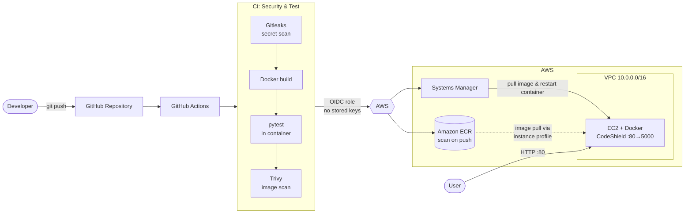

# 🛡️ CodeShield


**CodeShield** is a DevSecOps reference project: a small Flask application that is tested, security-scanned, containerized, and automatically deployed to AWS on every push — with the infrastructure defined entirely in Terraform.

The app itself is intentionally simple. The point of the project is the **pipeline around it**: secret scanning, container vulnerability scanning, keyless AWS authentication via OIDC, and zero-touch deployment to EC2 through AWS Systems Manager (no SSH keys, no long-lived credentials).

---

## Table of Contents

- [Highlights](#highlights)
- [Architecture](#architecture)
- [CI/CD Pipeline](#cicd-pipeline)
- [Tech Stack](#tech-stack)
- [Project Structure](#project-structure)
- [The Application](#the-application)
- [Getting Started](#getting-started)
- [Infrastructure (Terraform)](#infrastructure-terraform)
- [Security Model](#security-model)
- [Configuration](#configuration)
- [Roadmap](#roadmap)
- [Credits & License](#credits--license)

---

## Highlights

- **Shift-left security** — Gitleaks scans the repo for leaked secrets and Trivy scans the built image for `CRITICAL`/`HIGH` vulnerabilities on every run.
- **Keyless AWS access** — GitHub Actions authenticates to AWS with short-lived OIDC tokens. No AWS access keys are stored in GitHub secrets.
- **Zero-touch deployment** — pushes to `main` build, test, push to ECR, and roll out to EC2 via SSM `send-command`, then verify the `/health` endpoint before reporting success.
- **Hardened container** — slim base image, non-root user, and a built-in `HEALTHCHECK`.
- **Everything as code** — VPC, EC2, ECR, IAM, and the OIDC trust are all Terraform-managed.
- **Immutable, traceable images** — each image is tagged with the commit SHA (plus `latest`), and ECR keeps only the 5 most recent images.

---

## Architecture



---

## CI/CD Pipeline

The main workflow lives in [`.github/workflows/cloudsentinel-ci.yml`](./.github/workflows/cloudsentinel-ci.yml) (**CodeShield CI**) and runs on pushes to `main` / `codeshield-dev` and on pull requests to `main`.

| # | Stage | Runs on | What it does |
|---|-------|---------|--------------|
| 1 | **Secret scan** | push, PR | [Gitleaks](https://github.com/gitleaks/gitleaks-action) scans the repository for committed secrets |
| 2 | **Build** | push, PR | Builds the Docker image |
| 3 | **Test** | push, PR | Runs `pytest` inside the built container |
| 4 | **Image scan** | push, PR | [Trivy](https://github.com/aquasecurity/trivy-action) reports `CRITICAL`/`HIGH` OS and library vulnerabilities (unfixed issues ignored; currently report-only) |
| 5 | **AWS auth** | push only | Assumes an IAM role through GitHub OIDC |
| 6 | **Publish** | push only | Tags the image with the commit SHA and `latest`, pushes to Amazon ECR |
| 7 | **Deploy** | push only | Uses SSM `send-command` to pull the new image on EC2, replace the running container, and `curl` the `/health` endpoint |
| 8 | **Verify** | push only | Fails the pipeline if the SSM command doesn't finish with `Success` |

Pull requests run stages 1–4 only, so nothing is published or deployed from an unmerged change.

A second workflow, [`terraform.yml`](./.github/workflows/terraform.yml) (**Terraform CI**), runs `terraform fmt -check`, `init -backend=false`, and `validate` on pushes and pull requests to `main`, and comments the results on PRs.

---

## Tech Stack

| Layer | Tools |
|-------|-------|
| **Application** | Python 3.12, Flask 3.1, pytest |
| **Container** | Docker (`python:3.12-slim`, non-root user, healthcheck) |
| **CI/CD** | GitHub Actions |
| **Security** | Gitleaks (secrets), Trivy (image vulnerabilities), ECR scan-on-push |
| **Cloud** | AWS — VPC, EC2, ECR, IAM, Systems Manager, S3 |
| **IaC** | Terraform `>= 1.5` with the AWS provider `~> 5.0` |

---

## Project Structure

```
CodeShield/
├── app/
│   ├── app.py                    # Flask application (routes + config)
│   ├── requirements.txt          # Flask, pytest
│   └── templates/
│       └── index.html            # Status dashboard
├── tests/
│   └── test_app.py               # pytest tests for all endpoints
├── .github/workflows/
│   ├── cloudsentinel-ci.yml      # Scan → test → build → push to ECR → deploy
│   └── terraform.yml             # Terraform fmt / init / validate
├── Dockerfile                    # Hardened, non-root image with healthcheck
├── .dockerignore
│
├── providers.tf                  # Terraform + AWS provider, default tags
├── variables.tf                  # Input variables (with validation)
├── vpc.tf                        # VPC, subnet, internet gateway, routes
├── ec2.tf                        # EC2 instance + security group
├── ecr.tf                        # ECR repo (scan on push) + lifecycle policy
├── iam.tf                        # EC2 role: ECR read-only + SSM core
├── github-oidc.tf                # GitHub OIDC provider + deploy role
├── s3.tf                         # Versioned, encrypted, private S3 bucket
├── outputs.tf                    # Useful outputs (IPs, IDs, URL)
└── LICENSE
```

---

## The Application

A lightweight Flask service that exposes a status dashboard and two JSON endpoints.

| Endpoint | Description |
|----------|-------------|
| `GET /` | HTML dashboard showing health, version, environment, uptime, and the DevSecOps pipeline stages |
| `GET /health` | Health check — returns `{"status": "healthy", "version": ..., "environment": ...}`. Used by the Docker `HEALTHCHECK` and by the deployment verification step |
| `GET /api/info` | App metadata: name, version, environment, status, uptime in seconds, and a UTC timestamp |

Example:

```bash
curl http://localhost:5000/api/info
```

```json
{
  "application": "CodeShield",
  "version": "1.0.0",
  "environment": "development",
  "status": "running",
  "uptime_seconds": 42,
  "timestamp": "2026-01-01T12:00:00+00:00"
}
```

---

## Getting Started

### Prerequisites

- Python 3.12+ (for running locally)
- Docker (for the containerized workflow)
- Terraform `>= 1.5` and configured AWS credentials (only if you want to provision the infrastructure)

### Run locally

```bash
git clone https://github.com/arunava-12/CodeShield.git
cd CodeShield

python -m venv .venv
source .venv/bin/activate        # Windows: .venv\Scripts\activate
pip install -r app/requirements.txt

python app/app.py
```

Open <http://localhost:5000>.

### Run with Docker

```bash
docker build -t codeshield .
docker run --rm -p 5000:5000 codeshield
```

Override the runtime configuration if you like:

```bash
docker run --rm -p 5000:5000 \
  -e APP_VERSION=1.1.0 \
  -e ENVIRONMENT=staging \
  codeshield
```

### Run the tests

```bash
# Locally
PYTHONPATH=. pytest -q

# Or inside the container (exactly what CI does)
docker run --rm codeshield pytest -q
```

---

## Infrastructure (Terraform)

Terraform provisions the AWS side of the pipeline:

| Resource | Purpose |
|----------|---------|
| **VPC + public subnet + IGW + route table** | Network for the EC2 host (`10.0.0.0/16`, single AZ) |
| **EC2 instance** | Runs the CodeShield container; IMDSv2 required |
| **Security group** | HTTP (80) open to the internet; SSH limited to `allowed_ssh_cidr` and EC2 Instance Connect |
| **ECR repository** | Stores images; scan-on-push, AES-256 encryption, keeps the 5 newest images |
| **EC2 IAM role + instance profile** | `AmazonEC2ContainerRegistryReadOnly` (pull images) and `AmazonSSMManagedInstanceCore` (receive deploy commands) |
| **GitHub OIDC provider + IAM role** | Lets GitHub Actions push to ECR and run SSM commands without static credentials |
| **S3 bucket** | Versioned, encrypted, all public access blocked |

### Provision

```bash
terraform init
terraform plan
terraform apply
```

Tear everything down when you're done experimenting:

```bash
terraform destroy
```

> **Before you apply:** review `variables.tf` and adjust `aws_region`, `project_name`, and — importantly — `allowed_ssh_cidr` (set it to your own IP, e.g. `"203.0.113.10/32"`, via a `terraform.tfvars` file). Resource names such as the S3 bucket and the AMI ID are currently fixed in the code, so update them for your own account and region.

---

## Security Model

| Control | How it's implemented |
|---------|---------------------|
| **Secret detection** | Gitleaks runs on every push and PR |
| **Vulnerability scanning** | Trivy scans the built image in CI; ECR also scans on push |
| **No static cloud credentials** | GitHub Actions assumes an IAM role via OIDC; the trust policy is restricted to this repository |
| **Least-privilege CI role** | The deploy role can only push to the CodeShield ECR repo and use SSM `SendCommand` / `GetCommandInvocation` |
| **No SSH needed for deploys** | Deployments go through SSM; the instance role only has ECR read-only + SSM core |
| **Container hardening** | Slim base image, non-root `appuser`, `HEALTHCHECK`, `.dockerignore` keeps state files and secrets out of the image |
| **Instance hardening** | IMDSv2 enforced (`http_tokens = "required"`) to mitigate SSRF-based credential theft |
| **Storage** | S3 public access fully blocked, versioning and server-side encryption enabled; ECR images encrypted |
| **Secrets hygiene** | `*.tfstate`, `.terraform/`, `terraform.tfvars`, and `.env` are gitignored |

---

## Configuration

Runtime settings are read from environment variables:

| Variable | Default | Description |
|----------|---------|-------------|
| `APP_VERSION` | `1.0.0` | Version string shown in the UI and API responses |
| `ENVIRONMENT` | `development` | Environment label shown in the UI and API responses |

Terraform variables (see [`variables.tf`](./variables.tf)):

| Variable | Default | Description |
|----------|---------|-------------|
| `aws_region` | `eu-central-1` | Region for provisioned resources |
| `project_name` | `aws-terraform-starter` | Prefix used for names and tags |
| `environment` | `dev` | One of `dev`, `staging`, `prod` |
| `vpc_cidr` | `10.0.0.0/16` | VPC CIDR block |
| `public_subnet_cidr` | `10.0.1.0/24` | Public subnet CIDR block |
| `instance_type` | `t3.micro` | EC2 instance type |
| `allowed_ssh_cidr` | `0.0.0.0/0` | CIDR allowed to SSH — **restrict this** |

---

## Roadmap

- [ ] Make Trivy a blocking gate (`exit-code: 1`) for `CRITICAL` findings
- [ ] Add SAST (e.g., Bandit / CodeQL) and dependency scanning (Dependabot / `pip-audit`)
- [ ] Run the app behind a production WSGI server (Gunicorn) instead of Flask's dev server
- [ ] Put an Application Load Balancer + HTTPS (ACM) in front of the instance
- [ ] Move Terraform state to S3 with DynamoDB locking
- [ ] Add private subnets + NAT and multi-AZ deployment
- [ ] Add CloudWatch logs, metrics, and alarms
- [ ] Sign images (Cosign) and generate SBOMs
- [ ] Add a manual approval step before production deploys

---

## Credits & License

The Terraform foundation (VPC, EC2, S3) is adapted from [`aws-terraform-starter`](https://github.com/egezamb/aws-terraform-starter) by Ege Zambelli. CodeShield extends it with the containerized application, ECR, OIDC, and the full DevSecOps pipeline.

Released under the [MIT License](./LICENSE).